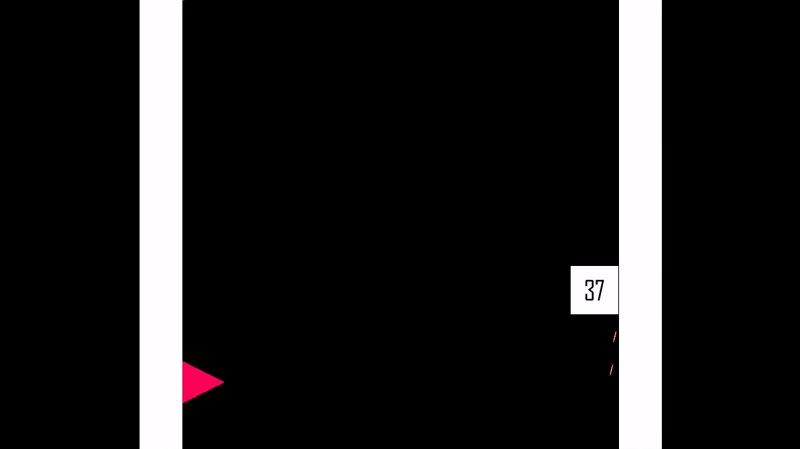
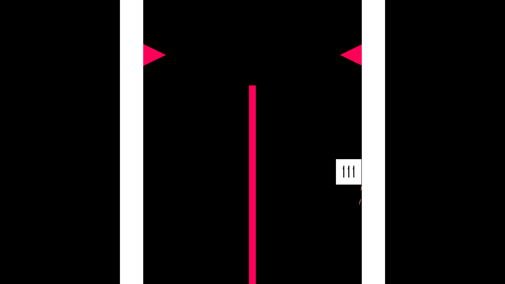

# Up&Up

Ловко обходи все преграды в игре Up&Up! Установи свой рекорд и соревнуйся с игроками со всего мира!
---

## Об игре
Up&Up - уникальный аркадный платформер. Здесь вы управляете квадратом, который двигается только вверх. Ваша задача заключается в том, чтобы не дать ему коснуться 
препятствий, перемещаясь от одной стены к другой, иначе игра закончится. На пути вам будут попадаться бонусы, помогающие продержаться как можно дольше и поставить новый рекорд. Ваш лучший результат можно будет увидеть в мировой таблице лучших игроков.

### Игровой цикл
Объект игрока - квадрат движется вверх, на пути ему встречаются препятствия - их необходимо обходить, перескакивая с одной стены на другую, чем выше игрок поднимается, тем больше препятствий и выше скорость. После столкновения с препятствием сессия заканчивается, лучший результат записывается и передается в лидерборд.
### Управление
Перемещение на противоположную стену осуществляется нажатием на любую клавишу. 
___
+ Движок: Unity;
+ Платформы: Windows, Android, WebGL;
+ YandexSDK: Интегрирован:
    + Лидербор;
    + Полноэкранная реклама;
    + Вознаграждение за рекламу (возможность продолжить попытку).
___
Игра снята с публикации.
